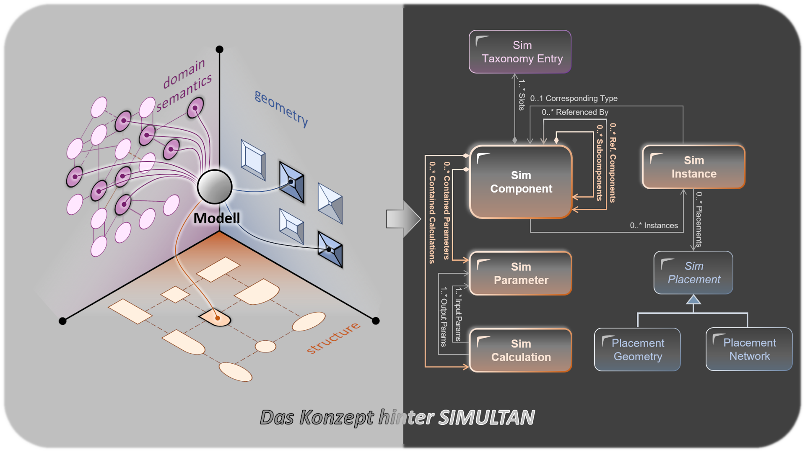
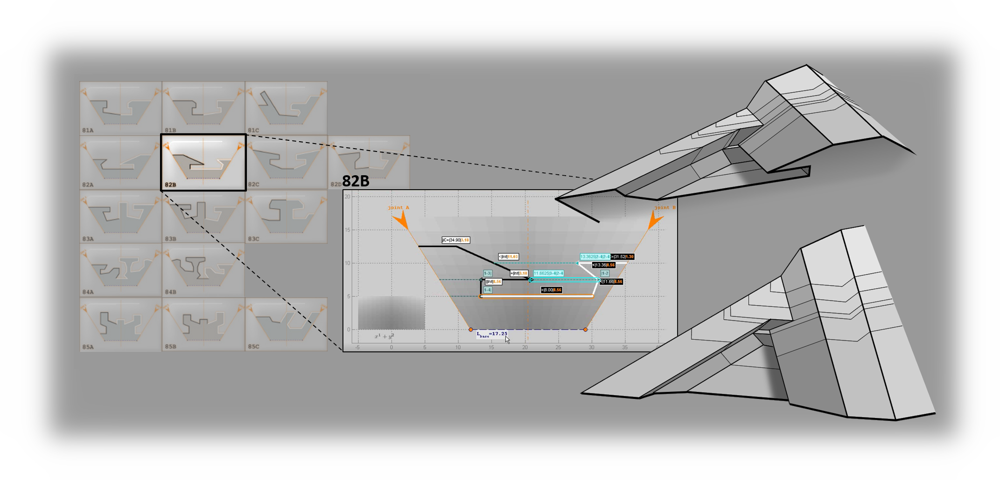
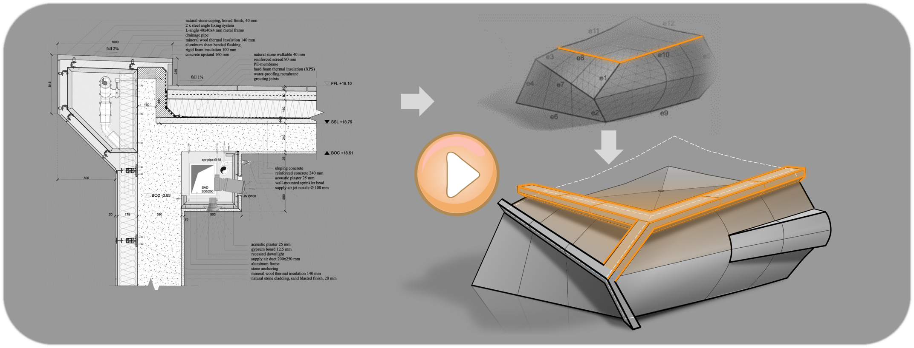

# Projects

This is an overview of past and current major projects. 

## 1. SIMULTAN *(2015 - present)*

This project was developed over the course of 11 years by an interdisciplinary team of software and civil engineers at the [TU Wien](https://www.tuwien.at/cee/mbb/bph) under the lead of [Prof. Thomas Bednar](https://tiss.tuwien.ac.at/person/37331.html).

<picture>
  <source media="(prefers-color-scheme: dark)" srcset="/assets/images/Simultan_dark.png">
  <source media="(prefers-color-scheme: light)" srcset="/assets/images/Simultan_light.png">
  
</picture>

[Initial publication in 2020](https://nachhaltigwirtschaften.at/resources/sdz_pdf/schriftenreihe-2020-04-simultan.pdf)

[Other publications](https://gitlab.tuwien.ac.at/simultangroup/SIMULTAN-Documentation/-/wikis/Publikationen-%C3%BCber-Simultan)

[Data model repository on GitLab](https://gitlab.tuwien.ac.at/simultangroup/SIMULTAN)

[Data model repository on GitHub](https://github.com/bph-tuwien/SIMULTAN)

[Data model documentation](https://gitlab.tuwien.ac.at/simultangroup/SIMULTAN-Documentation/-/wikis/home)

It was initially funded by the [Austrian Research Promotion Agency (FFG)](https://www.ffg.at/en); later it was further developed in close cooperation with multiple partners from the Architecture, Engineering and Construction (AEC) industry.

SIMULTAN is a meta-model. It offers a few generic building blocks for the construction of domain-specific models, e.g., for the model of a building, for the simulation model of a physical phenomenon, or for an electrical grid. A SIMULTAN model element behaves similarly to a [clabject](https://link.springer.com/article/10.1007/s10270-006-0017-9), i.e., an amalgamation of a class and an object.

<picture>
  <source media="(prefers-color-scheme: dark)" srcset="/assets/images/Clabject_dark.png">
  <source media="(prefers-color-scheme: light)" srcset="/assets/images/Claject_light.png">
  
</picture>

*Figure 1.1. The syntactic and semantic dimensions of a clabject.*

## 2. Procedural Shape Contraction *(2021 - 2023)*

This project demonstrates a method for integrating 2d construction documentation-level architectural details into a 3d conceptual model of a building, which transforms it into a detailed surface model.  The goal is to generate geometry that can be built in the designated material using the appropriate standardized techniques. The workflow consists of the following steps:

1. Each 2d detail is subjected to manual 1d feature extraction to determine those shapes that have an influence on the final 3d model.
2. The sharp features of the 3d model are extracted to obtain the building’s 3d skeleton, consisting of edge curves and corners.
3. We align the feature collection obtained from each detail with the 3d skeleton, in accordance with the architectural design. The goal is to build a 2-manifold with a boundary at each corner of the 3d skeleton.
4. Spanning ruled surfaces between neighbouring corner manifolds completes the final surface model.

This project focuses on the algorithm for constructing the corner manifolds: After the alignment of the feature collections with the 3d skeleton is performed, we calculate a rich descriptor, based on geometric relationship functions, for each feature. In addition, we construct its adjacency graph, containing all other features whose descriptor will change in case this feature is discarded. We then apply simultaneous procedural contraction to all feature collections affecting the same corner of the 3d model ([see Figure 2.1](#figure_2_1)). In each step a preservation score is calculated for all features, based on their descriptors. The feature with the lowest score is discarded and the descriptors and adjacency graphs for all others recalculated. This contraction produces ruled surface segments that are eventually stitched together into a 2-manifold with a boundary. The algorithm evaluation was performed by building a prototype in [MatLab](https://de.mathworks.com/products/matlab.html) and testing it on 170 detail combinations.

*Figure 2.1. Contracting a collection of 1d features step-by-step.*

[//]: # (<video width="600" src="https://github.com/user-attachments/assets/885bc938-5e18-46ca-8e63-fdc4c941c47c.mp4"></video>)
*Video 2.1. Prototype tests implemented in MatLab.*

The work was published as a [master thesis at TU Wien](https://repositum.tuwien.at/handle/20.500.12708/158223) and awarded the [Forschungspreis der Österreichischen Bundeskammer der Ziviltechniker:innen für 2023, BFG Informationstechnologie ](https://bund.zt.at/aktuell/veranstaltungen/veranstaltungsarchiv/forschungspreise-zivilingenieurwesen/preistraegerinnen-forschungspreise-2023).
